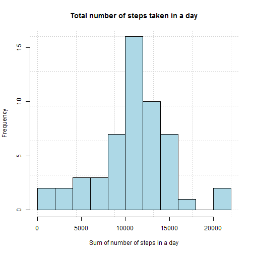
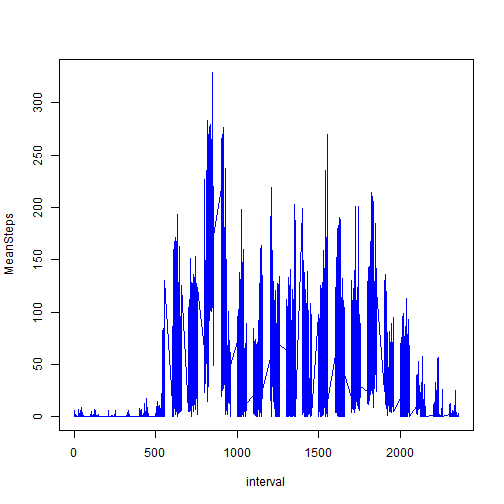
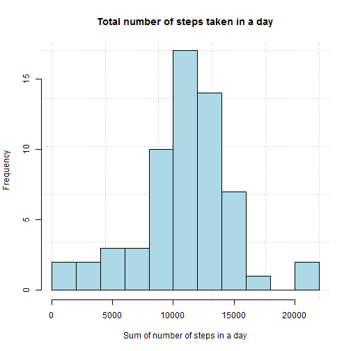
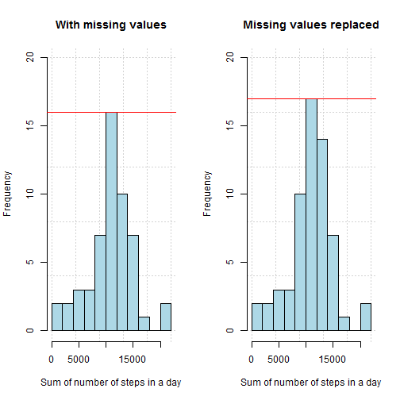
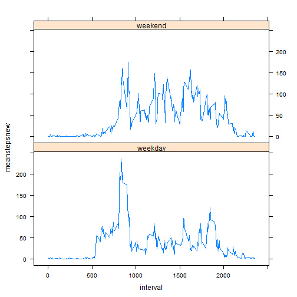

************

####Loading and preprocessing the data

*1. Load the data (i.e. read.csv())*

First, the data is loaded and read.


```r
library(lubridate)
library(plyr)
library(dplyr)
library(lattice)
options(scipen = 999)

fileUrl <- "http://d396qusza40orc.cloudfront.net/repdata%2Fdata%2Factivity.zip"
download.file(fileUrl, destfile <- "./activity.zip")
unzip("./activity.zip", exdir = ".")
activitydata <- read.csv("./activity.csv")
head(activitydata)
```

```
##   steps       date interval
## 1    NA 2012-10-01        0
## 2    NA 2012-10-01        5
## 3    NA 2012-10-01       10
## 4    NA 2012-10-01       15
## 5    NA 2012-10-01       20
## 6    NA 2012-10-01       25
```


*2. Process/transform the data (if necessary) into a format suitable for your analysis*

Here, the data is processed into a format suitable for my analysis. I convert the "date"" field to a "Date" format, and also insert a new column called "WeekDay", to show the day of the week.
        

```r
activitydata$date <- strptime(activitydata$date, "%Y-%m-%d")
activitydata$date <- as.Date(activitydata$date)
activitydata <- mutate(activitydata, WeekDay = weekdays(date))
head(activitydata)
```

```
##   steps       date interval WeekDay
## 1    NA 2012-10-01        0  Monday
## 2    NA 2012-10-01        5  Monday
## 3    NA 2012-10-01       10  Monday
## 4    NA 2012-10-01       15  Monday
## 5    NA 2012-10-01       20  Monday
## 6    NA 2012-10-01       25  Monday
```

************

####What is mean total number of steps taken per day?  


*1. Calculate the total number of steps taken per day.*

This calculates the number of steps taken per day.


```r
cdata1 <- ddply(activitydata, c("date"), summarise, N = sum(steps))
head(cdata1)
```

```
##         date     N
## 1 2012-10-01    NA
## 2 2012-10-02   126
## 3 2012-10-03 11352
## 4 2012-10-04 12116
## 5 2012-10-05 13294
## 6 2012-10-06 15420
```

 
*2. Make a histogram of the total number of steps taken each day.*

This creates a histogram of total number of steps taken each day.


```r
hist(cdata1$N, xlab = "Sum of number of steps in a day", main = "Total number of steps taken in a day", panel.first = grid(), col = "lightblue", breaks = 10)
```

 

```r
dev.copy(png, './figure/plot1.png')
```

```
## png 
##   3
```

```r
dev.off()
```

```
## png 
##   2
```


*3. Calculate and report the mean and median of the total number of steps taken per day.*


The mean and median are calculated here:

Parameter | Value
--------- | --------
Mean      | 10766.19
Median    | NA


************

####What is the average daily activity pattern?  

*1. Make a time series plot (i.e. type = "l") of the 5-minute interval (x-axis) and the average number of steps taken, averaged across all days (y-axis).*

I create a new dataset called "cdata2", which contains the fields: "interval", "WeekDay" and "MeanSteps". I plot the "interval" on the x-axis and the average number of steps on the y-axis.


```r
cdata2 <- ddply(activitydata, c("interval", "WeekDay"), summarise,
                MeanSteps = mean(steps, na.rm=TRUE))
head(cdata2)
```

```
##   interval  WeekDay MeanSteps
## 1        0   Friday  0.000000
## 2        0   Monday  1.428571
## 3        0 Saturday  0.000000
## 4        0   Sunday  0.000000
## 5        0 Thursday  5.875000
## 6        0  Tuesday  0.000000
```

```r
with(cdata2, plot(interval, MeanSteps, type = "l", col = "blue"))
```

 

```r
dev.copy(png, './figure/plot2.png')
```

```
## png 
##   3
```

```r
dev.off()
```

```
## png 
##   2
```
  
*2. Which 5-minute interval, on average across all the days in the dataset, contains the maximum number of steps?*

The figure is calculated here:


```r
cdata2[which.max(cdata2[, 3]), ]
```

```
##     interval WeekDay MeanSteps
## 743      850  Friday  328.5714
```

********

####Imputing missing values

*1. Calculate and report the total number of missing values in the dataset (i.e. the total number of rows with NAs).*


```r
sum(is.na(activitydata))
```

```
## [1] 2304
```

OR

This calculates the number of NAs in each column:


```r
na_count <- sapply(activitydata, function(x) sum(length(which(is.na(x)))))
na_count <- data.frame(na_count)
na_count
```

```
##          na_count
## steps        2304
## date            0
## interval        0
## WeekDay         0
```

*2. Devise a strategy for filling in all of the missing values in the dataset. The strategy does not need to be sophisticated. For example, you could use the mean/median for that day, or the mean for that 5-minute interval, etc.*

I have filled in the NAs with the average number of steps for that interval for that day (across the time period), taken from the "cdata2" dataset.

*3. Create a new dataset that is equal to the original dataset but with the missing data filled in.*


```r
activitydatanew <- merge(activitydata, cdata2, sort = FALSE, all = TRUE)
activitydatanew <- arrange(activitydatanew, date)
activitydatanew$steps[is.na(activitydatanew$steps)] <- activitydatanew$MeanSteps[is.na(activitydatanew$steps)] #Filling NAs with "MeanSteps"
activitydatanew$MeanSteps <- NULL #deleting the extra column, "MeanSteps""
head(activitydatanew)
```

```
##   interval WeekDay    steps       date
## 1        0  Monday 1.428571 2012-10-01
## 2        5  Monday 0.000000 2012-10-01
## 3       10  Monday 0.000000 2012-10-01
## 4       15  Monday 0.000000 2012-10-01
## 5       20  Monday 0.000000 2012-10-01
## 6       25  Monday 5.000000 2012-10-01
```


*4. Make a histogram of the total number of steps taken each day and Calculate and report the mean and median total number of steps taken per day.*


```r
cdata3 <- ddply(activitydatanew, c("date"), summarise, N = sum(steps))
head(cdata3)
```

```
##         date         N
## 1 2012-10-01  9974.857
## 2 2012-10-02   126.000
## 3 2012-10-03 11352.000
## 4 2012-10-04 12116.000
## 5 2012-10-05 13294.000
## 6 2012-10-06 15420.000
```

```r
hist(cdata3$N, xlab = "Sum of number of steps in a day", main = "Total number of steps taken in a day", panel.first = grid(), col = "lightblue", breaks = 10)
```

 

```r
dev.copy(png, './figure/plot3.png')
```

```
## png 
##   3
```

```r
dev.off()
```

```
## png 
##   2
```

```r
mean(cdata3$N)
```

```
## [1] 10821.21
```

```r
median(cdata3$N)
```

```
## [1] 11015
```

*Do these values differ from the estimates from the first part of the assignment? What is the impact of imputing missing data on the estimates of the total daily number of steps?*

The mean and median have both increased.

Parameter | With missing values              | After replacing missing values with mean
--------- | -------------------------------  | ----------------------------------------
Mean      | 10766.19   | 10821.21
Median    | 10765 | 11015

The histograms are produced here for comparison.


```r
par(mfrow = c(1, 2))
histo1 <- hist(cdata1$N, xlab = "Sum of number of steps in a day", main = "With missing values", panel.first = grid(), col = "lightblue", breaks = 10, ylim = c(0, 20))
abline(h = max(histo1$counts), col = "red")
histo2 <- hist(cdata3$N, xlab = "Sum of number of steps in a day", main = "Missing values replaced", panel.first = grid(), col = "lightblue", breaks = 10, ylim = c(0, 20))
abline(h = max(histo2$counts), col = "red")
```

 

```r
dev.copy(png, './figure/plot4.png')
```

```
## png 
##   3
```

```r
dev.off()
```

```
## png 
##   2
```

Both the mean and the median have increased.

As shown in the histograms, the sizes of the bins in the centre have also increased.  There is more data around the mean, as shown by the red horizontal lines marked at the maximum frequencies of the two histograms. This shows that imputing missing values might lead to an overestimation of the actual number of steps taken by an individual per day.

************

####Are there differences in activity patterns between weekdays and weekends?

*1. Create a new factor variable in the dataset with two levels - "weekday" and "weekend" indicating whether a given date is a weekday or weekend day.*

I insert a new column called "daytype" to indicate whether a given date is a weekday or a weekend day.


```r
activitydatanew <- mutate(activitydatanew, daytype = ifelse(WeekDay %in% c("Saturday", "Sunday"), "weekend", "weekday"))
head(activitydatanew)
```

```
##   interval WeekDay    steps       date daytype
## 1        0  Monday 1.428571 2012-10-01 weekday
## 2        5  Monday 0.000000 2012-10-01 weekday
## 3       10  Monday 0.000000 2012-10-01 weekday
## 4       15  Monday 0.000000 2012-10-01 weekday
## 5       20  Monday 0.000000 2012-10-01 weekday
## 6       25  Monday 5.000000 2012-10-01 weekday
```

*2. Make a panel plot containing a time series plot (i.e. type = "l") of the 5-minute interval (x-axis) and the average number of steps taken, averaged across all weekday days or weekend days (y-axis).*

The time series plot is produced here.


```r
cdata4 <- ddply(activitydatanew, c("interval", "daytype"), summarise, meanstepsnew = mean(steps, na.rm=TRUE))
head(cdata4)
```

```
##   interval daytype meanstepsnew
## 1        0 weekday     2.310714
## 2        0 weekend     0.000000
## 3        5 weekday     0.450000
## 4        5 weekend     0.000000
## 5       10 weekday     0.175000
## 6       10 weekend     0.000000
```

```r
xyplot(meanstepsnew ~ interval | daytype, cdata4, type = "l", layout = c(1, 2))
```

 

```r
dev.copy(png, './figure/plot5.png')
```

```
## png 
##   3
```

```r
dev.off()
```

```
## png 
##   2
```

On weekdays, there are fewer steps (lower average) taken in the 1000-2000 interval, than on weekends. However, there is a larger spike in the 800-1000 interval on the weekday graph. Overall, there appears to be more activity on the weekend than on  weekdays.
